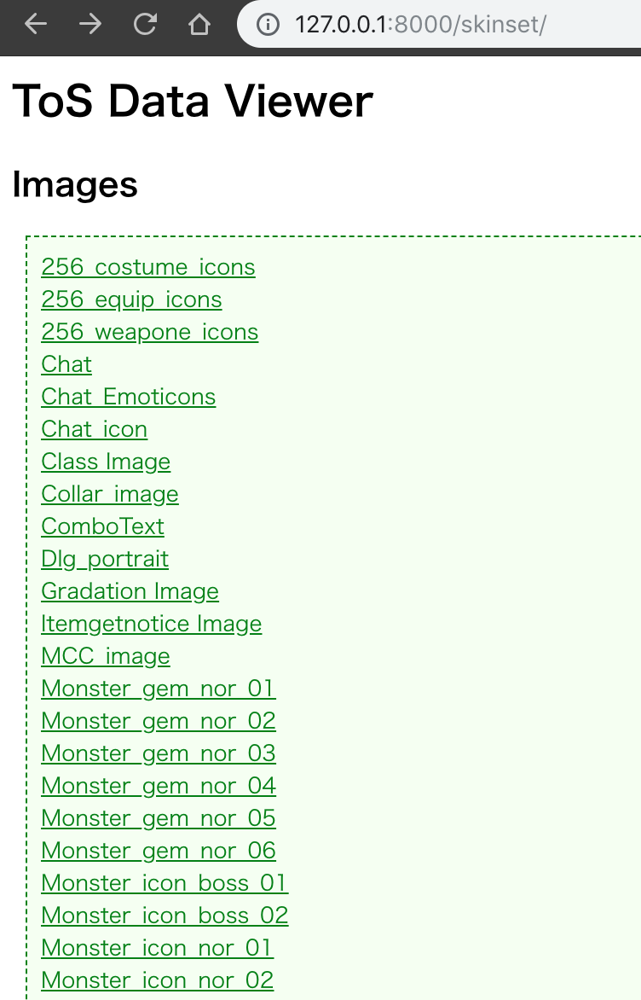

# tos-data-viewer
ToSのLua層で使用可能な画像リソースを閲覧するためのツールです.

## 概要
ToSの画像リソースは`<skinset>`要素をルートとしてファイル名`*.xml`または`*.skn`のXMLファイルで定義されています.
しかし、リソース名と実際のアイコンとの対応関係が（私にとっては）わかりにくいです.

わかりにくさの主な要因:
* 画像リソースを定義するXMLファイルは様々なパスに分散して格納されている
* 比較的大きな画像と、その画像をトリミングする領域を指定するという形式をとっている
* 使用されない画像リソースが多数含まれており、トリミング領域が正しくない要素が混在している
* tgaやbmp等、ブラウザで表示できない画像形式を含んでいる

本ツールではブラウザから画像リソースを閲覧するための機能を提供します.

提供するのは閲覧機能のみであり、閲覧対象のリソースファイル自体は含んでいません.
展開済み状態の下記ipfファイルを用意する必要があります.

* addon.ipf
* jp.ipf
* ui.ipf

## 環境
* [Python 3.7](https://www.python.org/)
* Django 2.1.3
* PyYAML 3.13
* Pillow 5.3.0 

```bash
pip install django PyYaml Pillow
```

## インストール

適当な場所へリポジトリをクローンします.
```bash
git clone https://github.com/tokageel/tos-data-viewer.git
```

展開済みの各ipfファイルをクローン先へコピーします.
（シンボリックリンクでも可）

```bash
cp -r [addon.ipfの格納場所] [jp.ipfの格納場所] [ui.ipfの格納場所] tos-data-viewer/data/
cp -r [ui.ipfの格納場所] tos-data-viewer/static/skinset
```

空のDBを作成します.

```bash
cd tos-data-viewer/config
python manage.py makemigrations
python manage.py migrate
```

XMLからFixtureを作成します.
```bash
cd skinset
python models_from_xml.py
cd ..
```

Fixtureを適用します.
```bash
python manage.py loaddata skinset/fixture/master.yaml
```

## 起動
```bash
python manage.py runserver 8000
```

## 使い方
ブラウザで http://localhost:8000/skinset へアクセスすると、一覧画面が表示されます.



## 免責事項
ご利用は自己責任でお願いします.
